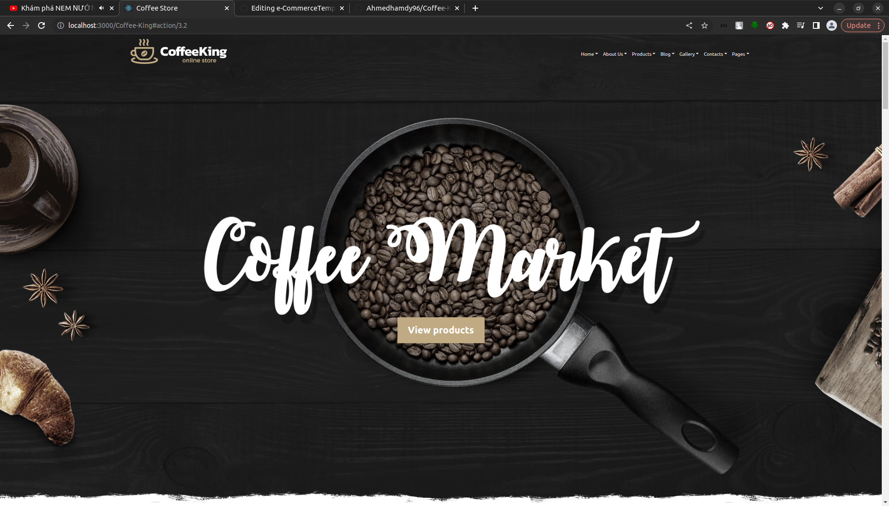
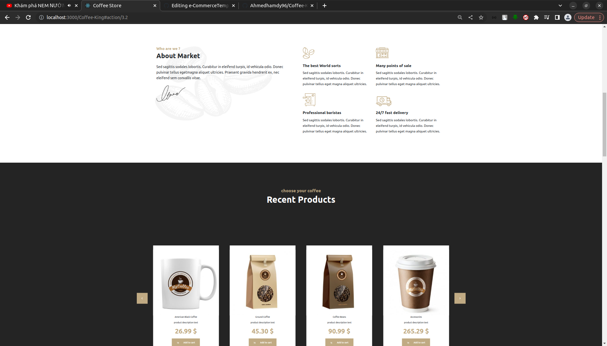
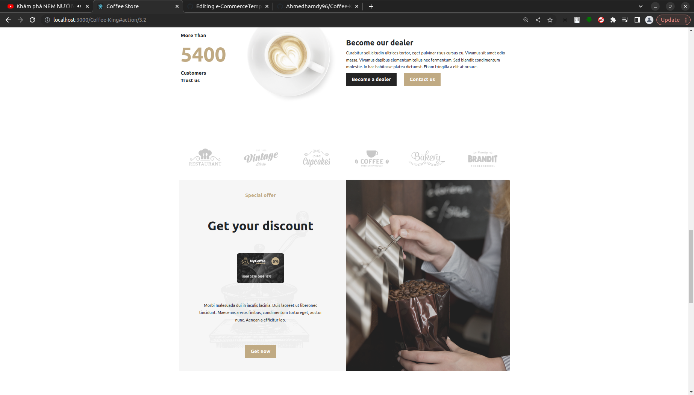
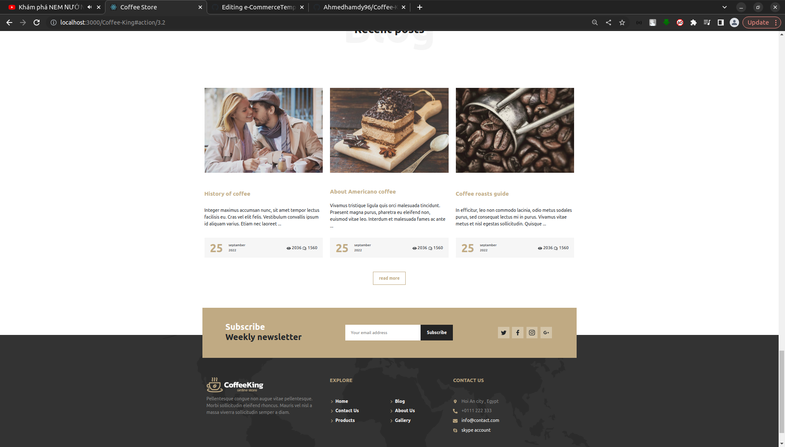

## Coffee store Template

 Built with React JS, Bootstrap 5

## Screen shot

## Table of contents

- [Quick start](#quick-start)
- [Thank](#thanks)

## Quick start

- Install with [npm](https://www.npmjs.com/): `npm install`
- Runs the app in the development mode `npm start`
- Builds the app for production to the `build` folder `npm run build`

## Thanks

